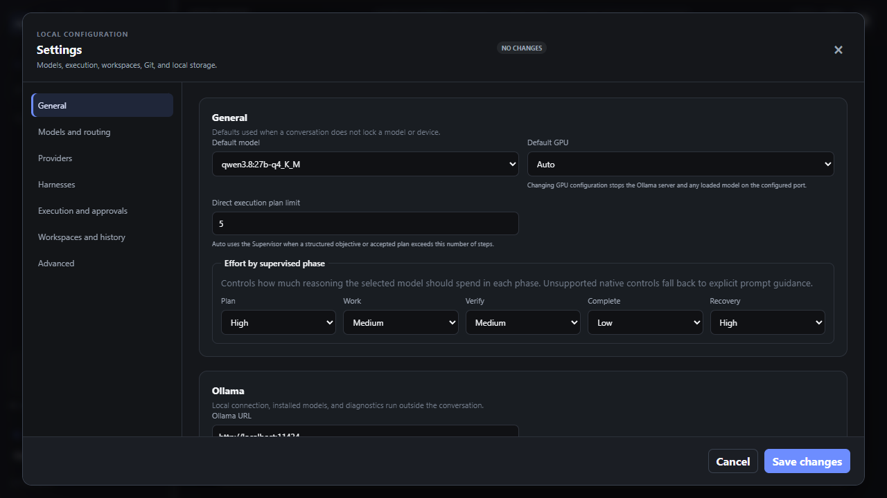

# Agentic Router

A **GPU-agnostic** local-first chat application that routes each user message to the most appropriate LLM through intent classification and model selection. Works with **1 to N GPUs**, CPU-only Ollama, or explicitly configured Groq, Google AI Studio, and Cerebras models.

## 🎯 Project Mission

Agentic Router is a focused local LLM router with a polished chat interface. It receives user messages in a continuous chat session, identifies the message intent with a lightweight router, resolves the model and device from user configuration, streams the selected model response, and exposes concise routing and inference activity in the UI.

The product remains intentionally smaller and simpler than a general-purpose agent orchestrator. An expert is a configured combination of intent, model, optional device preference, and system prompt—not an autonomous process, agent graph, or tool-using worker.

## 🏗️ Architecture Overview

The system follows a **Mixture of Experts (MoE)** approach and is **completely GPU-agnostic**:

### Hardware Flexibility

- **Single GPU**: Works seamlessly with one graphics card
- **Multi-GPU**: Supports multiple GPUs for distributed workloads
- **No GPU**: Runs on CPU-only systems
- **Remote Providers**: Connects to Ollama, Groq, Google AI Studio, or Cerebras through provider-specific HTTP contracts

### Optional Multi-GPU Distribution

For users with multiple GPUs, the system can distribute workloads strategically:

| Hardware | Role | Models Allocated | Strategic Advantage |
|----------|------|------------------|---------------------|
| **AMD Radeon RX 7900 XT** (24GB VRAM) | Continuous Hosting & Routing | Router Model (2B/8B) + Context Storage | Large memory capacity to keep the routing model always ready without interrupting the main GPU |
| **NVIDIA GeForce RTX 4090** (24GB VRAM) | High-Performance Inference | RPG Expert (8B Optimized) / Programming Expert | Ultra-fast tensor processing (Tensor Cores), ideal for fast generation of long texts and complex code |

**Note**: Multi-GPU is optional. The application automatically detects available GPUs and works with whatever hardware is present.

### Execution Pipeline

The application follows a flexible pipeline that adapts to available hardware:

1. **User Request**: User sends a prompt (e.g., "Create a dialogue for the tavern keeper based on campaign history")
2. **Intent Classification**: Router model analyzes the text to identify the user's intent
3. **Intent Detection**: Router identifies the intent (e.g., "rpg-storytelling") and triggers the appropriate expert
4. **Model Resolution**: System resolves the target model based on configuration precedence
5. **Device Resolution**: System selects the appropriate device (auto, specific GPU, or CPU-only)
6. **Provider Connection**: Application connects to Ollama Local or an enabled cloud provider through the provider registry
7. **Inference**: Provider processes the request and streams the response
8. **Response Streaming**: Response streams in real-time to the UI with routing activity visible

**Key Point**: Local GPU selection is an Ollama preference. Cloud providers own their remote hardware allocation and require an explicitly saved, Windows-protected API key.

## 🛠️ Tech Stack

### Backend
- **.NET 10** - Latest .NET platform
- **ASP.NET Core Web API** - Minimal hosting model with controllers
- **Provider registry** - Ollama Local, Groq, Google AI Studio, and Cerebras
- **Protected secrets** - Windows DPAPI with opaque references in ordinary settings
- **Server-Sent Events (SSE)** - Streaming mechanism for real-time updates
- **CancellationToken** - Proper async cancellation throughout the pipeline
- **GPU Discovery Service** - Automatic detection of available graphics devices (Windows)

### Frontend
- **Vanilla HTML, CSS, JavaScript** - No frameworks, no build pipeline
- **Server-Sent Events** - Real-time streaming of chat responses
- **Collapsible activity panels** - Routing and inference details in secondary UI area

### Testing
- **Playwright for .NET with MSTest** - Browser-driven end-to-end tests
- **Fake Ollama Server** - Deterministic test double for provider boundary
- **Fake Cloud Provider Server** - Deterministic Groq, Gemini, and Cerebras contracts without quota use

### Dependencies
- `HtmlSanitizer` (9.1.973) - Safe HTML rendering
- `Markdig` (1.3.2) - Markdown parsing

## 📁 Project Structure

```
/
  AGENTS.md                    # Project mission and architectural rules
  README.md                    # This file
  layout-example.html          # Visual reference for UI design
  AgenticRouter.slnx           # Solution file
  AgenticRouter.Api/
    Controllers/               # HTTP endpoints (Chat, Settings, Models, Devices)
    Chat/                      # Chat turn coordination and streaming
    Configuration/             # Settings store, validation, and defaults
    Devices/                   # GPU discovery service
    Markdown/                  # Safe markdown rendering
    Providers/
      Ollama/                  # Ollama HTTP communication
      Cloud/                   # Groq, Gemini, Cerebras, registry, and protected keys
    Contracts/                 # Typed request/response contracts
    wwwroot/
      index.html               # Main chat UI
      styles.css               # Application styling
      app.js                   # Frontend logic
    data/                      # Local JSON configuration store
  tests/
    AgenticRouter.EndToEndTests/
      ChatEndToEndTests.cs     # E2E test scenarios
      FakeOllamaServer.cs      # Test double for Ollama
      TestEnvironment.cs       # Test setup utilities
```

## 🚀 Getting Started

### Prerequisites

- **.NET 10 SDK** - Latest .NET runtime and SDK
- **Ollama** - Local LLM provider running on `http://localhost:11434` (or remote Ollama instance)
- **GPU** (optional): Any graphics card or multiple GPUs - application is GPU-agnostic
- **No GPU**: Application works on CPU-only systems

### Installation

1. Clone the repository:
```bash
git clone <repository-url>
cd agentic-router
```

2. Restore dependencies:
```bash
dotnet restore
```

3. Configure Ollama:
- **Local**: Ensure Ollama is running: `ollama serve`
- **Remote**: Configure the Ollama URL in settings (e.g., `http://remote-server:11434`)
- Pull required models: `ollama pull <model-name>`

4. Run the application:
```bash
dotnet run --project AgenticRouter.Api
```

5. Open browser at `http://localhost:5000`

### Hardware Requirements

The application is designed to work with any hardware configuration:

- **Minimum**: CPU-only system with Ollama
- **Recommended**: Single GPU for better performance
- **Advanced**: Multiple GPUs for distributed workloads
- **Remote**: No local GPU required if using remote LLM providers

### Configuration

Configuration is stored in a local JSON file in the `data/` directory. The application supports:

- Ollama base URL
- Router model selection
- Resident coordinator model selection
- Global default expert model
- Global default device (or `auto`)
- Configurable intent profiles
- Model override per intent
- Device override per intent or model
- System prompt per intent
- Request timeout values
- Heartbeat interval for long-running streams

Default intents include:
- `general-chat`
- `documentation`
- `software-development`
- `software-architecture`
- `rpg-storytelling`
- `review-and-testing`

The **Advanced** settings section can export and atomically import a portable
`agentic-router.yaml` backup. It includes the Ollama connection, router,
coordinator, default and intent models, GPU choices, system prompts, context,
runtime, execution, retention, project-awareness, and Git-delivery limits.
Ollama runtime role profiles, memory headroom, and exact model/digest overrides
are portable too. Workspace paths, conversations, validation commands,
approvals, and measured hardware evidence remain local and are intentionally
excluded.

Model roles use only `primary` and `fallback`:

```yaml
schema_version: 1
models:
  router:
    primary: qwen3:1.7b
  coordinator:
    primary: qwen3-coder:30b
  software-development:
    primary: qwen3-coder:30b
    fallback: qwen3.6:latest
  review-and-testing:
    primary: devstral-small-2
    fallback: gemma4:12b
```

Unsupported roles and keys are rejected with field and line diagnostics; the
existing configuration is not modified when parsing or validation fails. The
same operations are available at `GET /api/settings/yaml` and
`PUT /api/settings/yaml`.

### Ollama runtime context and memory profiles

Local Ollama requests use native `/api/chat` with a Host-selected `num_ctx`.
Profiles are resolved per router, resident coordinator, specialist, primary,
fallback, benchmark, model-test, web-search-synthesis, and vision role. An
optional override applies only to one exact local model ID and digest. The
provider context and model-declared context remain hard ceilings.

The resident coordinator defaults to 8,192 context tokens and is considered
ready only after `/api/ps` confirms the exact model and `context_length`.
Request fit reserves output and accounts for bounded messages, tool state, and
image overhead. It grows only through the configured discrete context ladder.

`GET /api/runtime/profiles` exposes policy and evidence.
`POST /api/runtime/profiles/analyze` reads metadata without loading a model.
`POST /api/runtime/profiles/measure` requires explicit permission because it
loads a real model; it is blocked during active requests and restores prior
resident state. Measured records stay local under
`data/runtime-profiles/ollama-model-memory.json` and are never included in
portable YAML.

### Token usage and equivalent cost

Runtime settings show token usage for rolling, daily, seven-day,
calendar-month, provider-specific, and bounded custom windows. Up to four
windows can be pinned. Events are stored locally as bounded daily JSONL under
`data/usage/`; the ledger contains usage metadata only and deliberately excludes
prompts, responses, images, tool arguments, file contents, and secrets.

Ollama terminal token counts are authoritative when present. Missing counts use
one conservative estimator and remain labeled as estimated. Local Ollama
inference has zero provider token cost. The optional cloud value is an
equivalent estimate against the explicitly selected comparison model and its
versioned official-source price snapshot; it is not an Ollama Cloud token quota
or an exact savings claim. Usage history can be queried through
`GET /api/usage/overview` and `GET /api/usage/summary`, while
`DELETE /api/usage?confirmed=true` explicitly purges it. Portable YAML includes
usage preferences but never exports the ledger.

### Cloud usage and mandatory local fallback

When an intent primary resolves to Groq, Google AI Studio, or Cerebras, its
fallback must resolve to one exact installed Ollama Local model. Settings reject
a missing, cloud, unavailable, or ambiguous fallback before saving. At runtime,
an eligible timeout, provider outage, rate limit, quota failure, or supported
transient provider error can switch once to that local model. Cancellation,
invalid requests, policy denials, and non-retryable failures never trigger the
fallback.

The clickable **Uso cloud** card is in the left sidebar above Recent
conversations. Its dashboard reads only the local provider cache and bounded
usage ledger. It shows quota accuracy, provider/model totals, observed roles,
cost estimates, reset information, 429 warnings, and local threshold alerts.
The expected Free tier, Paid, or Unknown billing mode changes display labels
only and is not a guarantee from the provider.

### Web search, citations, and image input

The composer shows the active provider/model plus compact Local, Cloud, Tools,
Web, Vision, Structured, Primary, and Fallback tags when supported. Capability
evidence comes from provider metadata, Ollama `/api/show`, explicit adapter
contracts, and separate behavioral tool conformance; model names alone do not
prove support.

Web search is always off until the user enables it. Google AI Studio uses
Google Search grounding on supported Gemini models, Groq search is limited to
officially supported Compound systems, and Cerebras does not advertise search
without authoritative metadata. Local models can use a separately configured,
DPAPI-protected Ollama Web Search key as a bounded read-only integration. It
does not restore Ollama Cloud model discovery. Search content is treated as
untrusted data, only absolute HTTPS citations are rendered, and results cannot
invoke local tools.

JPEG, PNG, WebP, and GIF images can be selected, dropped, or pasted into the
composer. The Host verifies signatures, count, decoded byte limits, dimensions
where practical, and the selected model's vision contract; SVG and mismatched
content are rejected. Before a cloud provider receives image bytes, the user
must confirm that upload for the current browser session and provider. History
stores only bounded attachment metadata with a `missing-attachment` marker;
image bytes and cloud-upload approvals are never persisted.

## 🎮 Usage

### Interface Overview

The application provides a clean, dark-themed interface with real-time status monitoring:


**Main Interface Features:**
- **Sidebar Status**: Shows Ollama connection status, available local models, detected graphics devices, trusted workspace, authoritative Git state, token usage, and clickable cloud usage
- **Chat Workspace**: Main conversation area with streaming responses
- **Model Selector**: Choose "Auto" for intent-based routing or select a specific model
- **Workspace Manager**: Uses collapsible sections for saved workspaces, local history, project profile, and validation profile; the `+` action reveals the new-workspace form only when needed
- **Collapsible Activity**: Routing and inference details in expandable panels
- **Recent Conversations**: Shows saved sessions for the active workspace and supports explicit resume
- **Git Panel**: Shows repository overview and bounded current-session, working-tree, staged, and last-commit diffs

### Configuration Dialog

Click the "Configurações" button to access the configuration interface:



**Configuration Options:**
- **Section Navigation**: Uses a near-full-viewport desktop menu and a compact selector on narrow screens
- **General Settings**: Ollama URL, router and coordinator models, default model, default GPU
- **Intent Configuration**: Per-intent model overrides, device preferences, and system prompts
- **Model Selection**: Choose from installed Ollama models for each intent
- **Workspace and Git Summaries**: Opens the trusted-workspace, history, validation, and read-only Git configuration surfaces
- **Portable YAML**: Import, copy, download, and restore global configuration without exporting workspace-local or conversation data

### Sending a Message

1. Type your message in the composer at the bottom
2. Press **Enter** to send (Shift+Enter for line break)
3. The router classifies your intent
4. The appropriate expert model is selected based on configuration precedence
5. Response streams in real-time with routing activity visible in collapsible details

### Model Resolution Precedence

The expert model is resolved in this order:
1. Model explicitly selected for the current request
2. Configured model override for the detected intent
3. First installed and available model in intent's preferred-model list
4. Configured global default model
5. Fail with actionable configuration error

### Device Resolution Precedence

The device preference is resolved in this order:
1. Request-level device override (when supported)
2. Detected intent's configured device override
3. Selected model's configured device override
4. Global default device
5. `auto`, delegated to the provider

**Important**: The application discovers available GPUs and presents them as options. However, the final GPU allocation is handled by the provider (Ollama). If Ollama cannot honor per-request device binding in the active runtime, the application reports this limitation clearly and uses the provider's configured default behavior.

### Configuration UI

Click the **⚙️ Configurar Agentes e Intenções** button to:
- Set model overrides per intent
- Configure device preferences (Default, Placa 1, Placa 2)
- Customize system prompts for each intent
- Manage preferred model lists

Press **Escape** to close the configuration dialog.

## 🧪 Testing

### Run End-to-End Tests

```bash
dotnet test tests/AgenticRouter.EndToEndTests/AgenticRouter.EndToEndTests.csproj
```

### Run the real Ollama protocol benchmark

Start the Release Host against the intended Ollama instance. After confirming
that the GPU is available, run:

```powershell
.\scripts\run-real-tool-protocol-benchmark.ps1 `
  -BaseUrl http://127.0.0.1:5294 `
  -TimeoutSeconds 1500
```

The benchmark uses the Host's production conformance service and records a
machine-readable JSON report plus a Markdown summary under the ignored
`artifacts/benchmarks/` directory. It runs models sequentially and keys each
result by exact model, digest, and Ollama version. The v0.9.1 release evidence is
documented in
[`docs/benchmarks/v0.9.1-ollama-0.32.5.md`](docs/benchmarks/v0.9.1-ollama-0.32.5.md).

### Test Coverage

The E2E suite covers:
- Application and chat UI load successfully
- Configuration loads, validates, saves, and survives page refresh
- Documentation request resolves to configured documentation model
- Request-level model override wins over automatic resolution
- Single-device environment works without GPU prompting
- Streamed tokens build one continuous assistant response
- Activity events remain collapsible while answer streams
- Next user message retains prior session context
- Unavailable model produces useful visible error with trace ID
- Provider failure reaches UI without generic silent fallback
- Explicit native tool-protocol conformance uses the installed model digest and typed failures

**Note**: Each test has a maximum timeout of 60 seconds. Tests exceeding this limit indicate implementation or synchronization issues that must be resolved.

## 📡 Streaming Contract

The application uses Server-Sent Events (SSE) to stream typed events:

- `turn.started` - Turn processing begins
- `intent.detected` - Router identifies user intent
- `route.selected` - Model and device resolved
- `model.started` - Expert model begins inference
- `response.delta` - Text token for assistant answer
- `heartbeat` - Keep-alive during token gaps
- `response.completed` - Turn finished successfully
- `turn.failed` - Turn failed with error

Only `response.delta` contributes to the visible assistant answer. Routing, model, device, timing, and heartbeat events appear in a secondary collapsible activity area.

## ⚠️ Explicit Non-Goals

The following are explicitly out of scope unless a later approved specification requests them:

- Shell, PowerShell, process, file-system, desktop, or OS execution
- Local tools, MCP tools, plugins, or function calling
- Autonomous agents, recursive delegation, agent graphs, planning graphs, or approval gates
- Workflow builders, queues, schedulers, or background job systems
- Hugging Face training pipelines, fine-tuning, LoRA, dataset preparation, or tokenizer management
- RAG, embeddings, vector databases, document ingestion, or knowledge bases
- Custom GPU schedulers or VRAM allocation engines (delegated to provider)
- Databases, repository patterns, event buses, CQRS, MediatR, or microservices
- Authentication, accounts, teams, permissions, billing, telemetry platforms, installers, auto-update, or release infrastructure
- Image generation
- Persistent chat history across application restarts

**Note**: Remote model providers beyond Ollama are not implemented in v1, but the architecture leaves clean extension points for future HTTP-based providers (OpenAI, Anthropic, etc.).

## 🔮 Future Vision

The specification document describes a broader vision involving:

- **Hugging Face Ecosystem Integration**: Datasets for data collection, Tokenizers for text processing, Transformers for training and inference
- **Fine-Tuning with LoRA**: Efficient parameter adaptation for custom RPG universes
- **Custom GPU Scheduling**: Advanced VRAM management and model caching strategies

These capabilities require separate specifications and are not implemented in the current version. The current implementation focuses on the core routing and inference pipeline using Ollama as the provider.

## � Key Architectural Insights

### GPU-Agnostic Design

The application is built to be completely hardware-agnostic:

- **GPU Discovery**: `WindowsGpuDiscoveryService` uses Windows SetupAPI to detect available graphics devices, but gracefully degrades on non-Windows systems or when discovery fails
- **Always Available "Auto" Option**: The `auto` device is always present, delegating hardware selection to the provider
- **Provider Delegation**: The app passes device preferences to the provider (Ollama) but doesn't enforce GPU allocation - the provider handles final hardware binding

### HTTP-Based Provider Architecture

The `IOllamaClient` interface demonstrates a clean HTTP-based provider pattern:

- **Standard HTTP Client**: Uses `HttpClientFactory` for provider communication
- **Extensible Design**: The interface can be implemented for any HTTP-based LLM provider (OpenAI, Anthropic, etc.)
- **Streaming Support**: Full async streaming support via `IAsyncEnumerable`
- **Error Handling**: Provider-specific exceptions with stage, message, and recoverability information

### Configuration-Driven Routing

- **Intent-Based Routing**: Router classifies requests into predefined intents (general-chat, documentation, software-development, etc.)
- **Model Precedence**: Clear precedence rules for model selection (explicit → intent override → preferred list → global default)
- **Device Precedence**: Clear precedence rules for device selection (request-level → intent → model → global → auto)
- **JSON Configuration**: All settings stored in local JSON, no database required

## �� Development Guidelines

### Code Quality

- SOLID principles applied pragmatically
- Focused classes and methods with clear names
- Prefer clear code over explanatory comments
- No comments unless explaining non-obvious reasons or constraints
- Avoid `#region` blocks and premature abstractions
- Prefer immutable records for contracts
- Keep I/O at edges
- Zero errors and zero warnings in Release build

### Change Discipline

Before editing:
1. Inspect repository structure and relevant files
2. Review current build and test commands
3. Read root layout example when changing UI behavior
4. State smallest implementation slice

While editing:
- Preserve existing working behavior
- Make smallest coherent vertical change
- Do not refactor unrelated code
- Do not add future features as scaffolding

After editing:
1. Run formatting if configured
2. Run `dotnet build` in Release configuration
3. Run relevant Playwright E2E tests
4. Verify no test exceeds 60 seconds
5. Report changed files, commands, results

## Maintainer diagnostics and recovery

The production UI creates and inspects full local recovery archives from
Settings > Advanced. Conversations, summaries, usage, and bounded review facts
are optional; secrets and active runtime authority are always excluded.

The default maintainer diagnostic is read-only and does not invoke a model, GPU,
or cloud provider:

```powershell
.\tools\diagnostics\Run-AgenticRouterDiagnostics.ps1
```

See `tools/diagnostics/README.md` and
`docs/pre-1.0-readiness-checklist.md` for opt-in validation and release gates.

## 📄 License

[Specify your license here]

## 🤝 Contributing

[Specify contribution guidelines here]

## 📞 Support

For issues and questions, please refer to `AGENTS.md` for detailed architectural rules and implementation guidelines.
