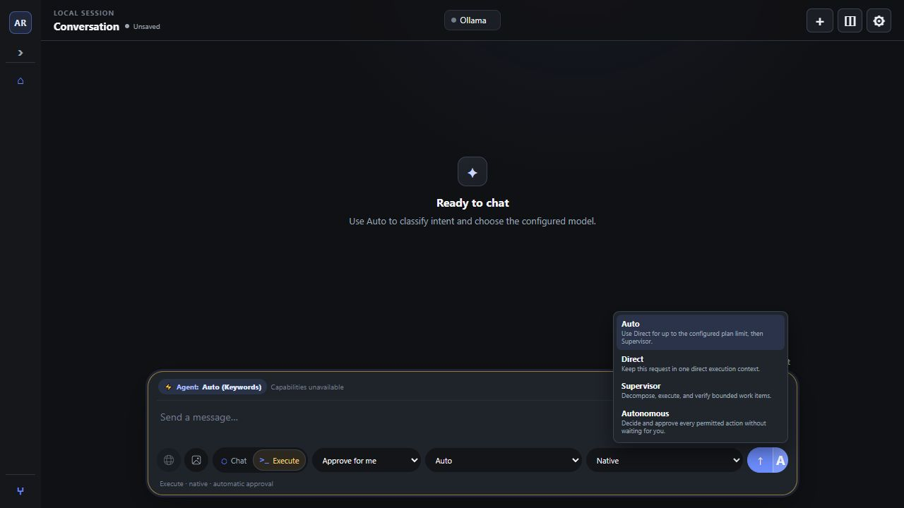

# Agentic Router — portable Windows and Linux x64 guide

Agentic Router runs local AI conversations and supervised workspace changes through a selected **model + harness**. The portable Windows and Linux x64 packages include the application and the .NET runtime; Ollama, local models, and optional harnesses are installed separately from the first-run screen or **Settings → Local resources**. Linux ARM64 and macOS are not supported release targets yet.

> **Alpha software:** review generated changes before committing them. Agentic Router confines Execute actions to the trusted workspace, but models can still make incorrect changes.

## Current release

| Version | Platform | Package | Checksum |
| --- | --- | --- | --- |
| `v0.11.0_alpha` | Windows x64 | [Download ZIP](https://github.com/Shakansis/agentic-router-releases/releases/download/v0.11.0_alpha/AgenticRouter-0.11.0_alpha-win-x64.zip) | [SHA-256](https://github.com/Shakansis/agentic-router-releases/releases/download/v0.11.0_alpha/AgenticRouter-0.11.0_alpha-win-x64.zip.sha256) |
| `v0.11.0_alpha` | Linux x64 | [Download tar.gz](https://github.com/Shakansis/agentic-router-releases/releases/download/v0.11.0_alpha/AgenticRouter-0.11.0_alpha-linux-x64.tar.gz) | [SHA-256](https://github.com/Shakansis/agentic-router-releases/releases/download/v0.11.0_alpha/AgenticRouter-0.11.0_alpha-linux-x64.tar.gz.sha256) |

[View all versions and release notes](https://github.com/Shakansis/agentic-router-releases/releases).

## What's new in 0.11.0_alpha

- Adds an integrated Execute strategy selector to the Send button: Auto, Direct,
  Supervisor, or explicit Autonomous for eligible local work.
- Makes durable supervision visible and recoverable through a Host-owned queue,
  current-artifact verification, bounded checkpoints, restart reconciliation,
  and browser reattachment.
- Adds Host-owned `low`, `medium`, or `high` reasoning effort for Plan, Work,
  Verify, Complete, and Recovery phases, with reviewed per-harness mappings.
- Strengthens Host effect evidence, exact tool handling, approval-wait timing,
  stale-state revalidation, and bounded trace reconstruction.

## 1. Download and start

1. Open the [latest Agentic Router release](https://github.com/Shakansis/agentic-router-releases/releases).
2. Download the archive for your OS and its matching `.sha256` file.
3. Verify a Windows download in PowerShell:

   ```powershell
   (Get-FileHash .\AgenticRouter-0.11.0_alpha-win-x64.zip -Algorithm SHA256).Hash.ToLowerInvariant()
   Get-Content .\AgenticRouter-0.11.0_alpha-win-x64.zip.sha256
   ```

   The two hashes must match.

   Verify a Linux download with:

   ```bash
   sha256sum -c AgenticRouter-0.11.0_alpha-linux-x64.tar.gz.sha256
   ```

4. Extract the archive to a writable folder. Do not run the application from inside the archive.
5. On Windows, double-click `AgenticRouter.exe`. On Linux x64, run:

   ```bash
   chmod +x AgenticRouter run-agentic-router.sh
   ./run-agentic-router.sh
   ```

6. Keep the terminal open and open the address shown there. Agentic Router uses
   port 5000 when available and automatically selects another local port when
   5000 is occupied.

The application stores configuration and optional local history in the `data` directory beside the executable. Keep that directory when upgrading if you want to preserve them.

## 2. Complete local setup

The first-run screen shows what is available on the computer. A usable local setup needs:

- **Ollama**;
- at least one Ollama model compatible with the available GPU memory;
- a harness only when you want Execute mode. **Codex is recommended for Execute** because it is currently the most stable option, but it is not mandatory.

Use the download or install action beside a missing resource. Agentic Router starts the official installer or harness installation and then checks whether the resource became available.

On Linux, guided installation currently covers Ollama. Install optional harnesses
from their official Linux instructions and place their executables on `PATH`;
Agentic Router then verifies them through the normal discovery path.

On Linux with AMD hardware, Ollama setup requires an explicit acceleration choice:

- **Vulkan** uses the official base package and enables `OLLAMA_VULKAN=1`. It offers broader AMD/Intel coverage but Ollama currently documents it as experimental.
- **ROCm** uses the official base plus ROCm supplemental package. It is intended for supported AMD GPUs and requires compatible ROCm v7 drivers.

Agentic Router never installs GPU drivers or models silently. It reports the requested profile, package manifest, actually observed backend, and CPU fallback separately. A later profile change shows an exact plan, preserves models/data, requires confirmation, and removes only files proven exclusive to the previous supplemental package.


The same controls remain available later under **Settings → Local resources**. Installed resources display a check mark; unavailable resources retain their install action.


## 3. Select a trusted workspace

Execute mode can read and change files only inside the active trusted workspace.

1. Open the workspace menu in the left sidebar.
2. Select **Add workspace**.
3. Enter a recognizable name and the full folder path.
4. Save and activate the workspace.

Use a dedicated project folder. Existing files are allowed, but Git makes review and recovery much easier.

### Add project knowledge with AnythingLLM

AnythingLLM is optional and remains a retrieval-only knowledge service.

1. Open the selected project's **Edit project** action.
2. Under **Knowledge / RAG**, enter the AnythingLLM server address and developer
   API key, then save the connection.
3. Select one or more AnythingLLM workspaces and save the project knowledge.
4. Enable Knowledge/RAG for that project.

Agentic Router retrieves relevant chunks before an enabled turn and injects
them into its managed context. Agentic Router still owns model and harness
routing, generation, execution, security, and persistence. Turning Knowledge/RAG
off preserves the saved connection and library selection. Document upload,
indexing, embeddings, chunking, and vector storage remain in AnythingLLM.

## 4. Initialize Git

If the selected folder is not already a repository:

1. Switch to **Execute**.
2. Open the **Git** card in the left sidebar.
3. Select **Initialize Git** and confirm.


Agentic Router creates a local repository on `main`. It does not create a commit, remote, or push anything automatically.


## 5. Use Chat with images

Chat answers questions without changing workspace files.

1. Select **Chat**.
2. Choose a model with the **Vision** capability.
3. Use the image button to attach JPEG, PNG, WebP, or GIF files.
4. Enter a prompt and send it.

Example:

```text
Use these references to create a polished project landing page.
```


The model analyzes the attached images and returns its proposal in the conversation.


### Use current web evidence

The globe beside the composer is automatic. It appears enabled when the effective
model, provider, harness, or configured Host integration can search the web; there
is no search toggle to manage. An enabled globe means the capability is available,
not that every prompt performs a search—the selected model or native provider
decides when current external evidence is needed.

Provider-native and harness-native search remain available when supported. Local
tool-capable models can also use the optional Ollama Web Search integration configured
under **Settings > Providers**. Search results are treated as untrusted content and
visible citations are restricted to absolute HTTPS links.

## 6. Create files with Execute

Execute is for supervised project work.

1. Select **Execute**.
2. Choose the model and harness. Codex is recommended; Native is also available when the selected model supports Agentic Router's structured execution protocol.
3. Use the small right-hand segment of **Send** to choose the execution strategy:
   **Auto (`A`)**, **Direct (`D`)**, **Supervisor (`S`)**, or
   **Autonomous (`∞`)**. Then use the main Send segment or Enter normally.
4. Choose the approval policy when using Auto, Direct, or Supervisor. Autonomous
   deliberately disables this selector because it approves every action the user
   could permit for that run; hard Host boundaries remain enforced.
5. Send a bounded objective. For this example:

   ```text
   Create index.html with a Hello World page.
   ```

Agentic Router records planned actions, applies the effective approval policy, verifies file effects, and reports the authoritative result.



**Auto** is the default. It stays in Direct for bounded work and selects Supervisor
when a structured objective or accepted plan exceeds the configured limit (five
steps by default). **Direct** forces one execution context. **Supervisor** decomposes
and verifies a durable serial queue. **Autonomous** uses that same supervised flow but
does not stop for a discretionary approval decision. It cannot escape the trusted
workspace, authorize a forbidden process, weaken validation, or bypass any other
hard Host policy.

When the effective policy requires approval, sensitive process commands wait for an
explicit decision. For eligible exact commands, **Always allow exact command** records
only the resolved executable, exact
arguments, and working directory for the active workspace. It does not grant general
shell access. Review or revoke saved entries under **Settings > Execution and
approvals > Persistent process permissions**.


### Supervise a larger local task

Select **Supervisor** on the Send button, or prefix an Execute objective with
`/supervisor`, to enable durable supervised execution.
The same selected local model and harness work serially in focused supervisor and
worker contexts. The supervisor checks current Host-observed files and validation
facts, rejects incomplete work with a precise correction, and accepts completion only
after the criteria are covered.

When local history is enabled, closing or reloading the browser does not cancel the
run. Resume the saved conversation to reattach and replay progress. After an
application restart, the `manual` policy waits for an explicit Resume; `auto-safe`
continues only when the route, workspace, committed actions, approvals, and recovery
budget are unambiguous. Supervised runs accept local Ollama routes only and never use a
cloud fallback.

### Configure effort by phase

Open **Settings > General > Effort by supervised phase** to choose `low`,
`medium`, or `high` for Plan, Work, Verify, Complete, and Recovery. These values
are reasoning-effort levels, not Benchmark scoring weights. They affect how much
reasoning the selected model should spend in each supervised phase; they do not
change the model/harness route, tools, approvals, workspace boundaries, validation,
or recovery limits.

The defaults are **Plan high**, **Work medium**, **Verify medium**, **Complete low**,
and **Recovery high**. Planning and recovery receive more effort because mistakes
there propagate or require diagnosis; repeated implementation and evidence-based
verification stay balanced; completion only summarizes work the Host has already
accepted. Native Ollama, Codex, OpenCode, and Qwen Code receive reviewed native or
translated effort controls. Claude Code through Ollama uses visible prompt guidance
because that compatibility route exposes no reviewed effort field.

## 7. Review and open the result

Open the **Git** card to inspect changed files and the generated diff before committing.


For this example, opening `index.html` displays the generated page:


Use **View folder** beside **Commit** and **Push** to open the current workspace in Windows Explorer or the Linux desktop file manager.


## 8. Stop, update, or move the portable app

- Stop Agentic Router with `Ctrl+C` in its terminal or by closing that window.
- Before replacing an alpha build, back up the adjacent `data` directory.
- Extract a new version to a clean folder, then copy the previous `data` directory only if you want to retain its settings and optional history.
- Do not copy `data` to another computer unless you intend to transfer its local configuration.

## Troubleshooting

- **The welcome screen remains visible:** confirm that Ollama is running and at least one model is installed, then refresh the resource check.
- **A harness is missing:** open **Settings → Local resources** and use its install action. A harness can be selected in Chat, but it is applied only when Execute runs.
- **Images are not analyzed:** select a model showing the **Vision** capability before sending.
- **Execute cannot change files:** confirm the correct trusted workspace is active and review the selected approval policy.
- **Linux cloud keys are unavailable:** install `libsecret-tools` and ensure the desktop user keyring is active.
- **Linux folder picker is unavailable:** install `zenity` or `kdialog`, or enter the workspace path manually. `xdg-utils` is required for **View folder**.
- **The page does not open:** use the exact local address printed in the terminal and keep Agentic Router running.

Use of this alpha build is governed by the [Agentic Router Alpha Evaluation License](LICENSE.md).
